<div align="center">

# 🌾 AgriHub

### **India's Most Comprehensive Agriculture Intelligence Super-App**

*Transforming Indian agriculture through technology — connecting 140M+ farmers, FPOs, and buyers on a single unified platform*

<br>

[](https://nodejs.org/)
[](https://expressjs.com/)
[](https://www.postgresql.org/)
[](https://redis.io/)
[](https://kotlinlang.org/)
[](https://developer.android.com/jetpack/compose)
[](https://docker.com/)
[](./backend/src/services/websocket.js)

<br>

[](https://github.com/hari888b8/AAA/actions)
[](./LICENSE)
[](./CONTRIBUTING.md)
[](./)
[](./backend/src/routes)

<br>

[**🚀 Quick Start**](#-quick-start) · [**📖 Documentation**](#-architecture-overview) · [**🔌 API Reference**](#-api-reference) · [**📱 Screenshots**](#-screenshots--ui-showcase) · [**🗺️ Roadmap**](#-roadmap)

---

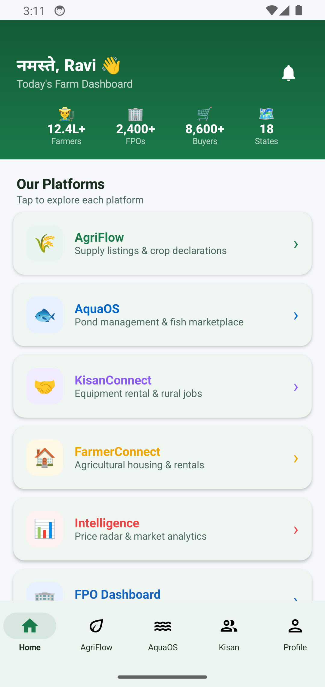 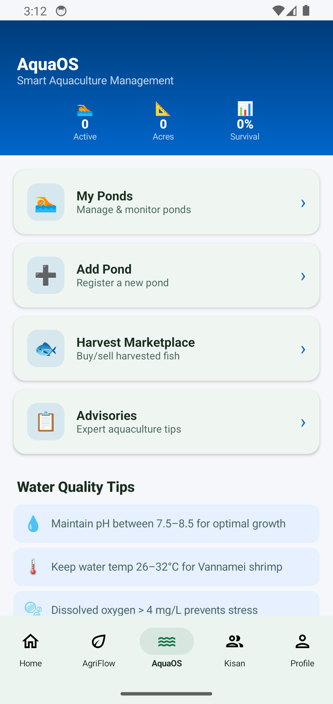 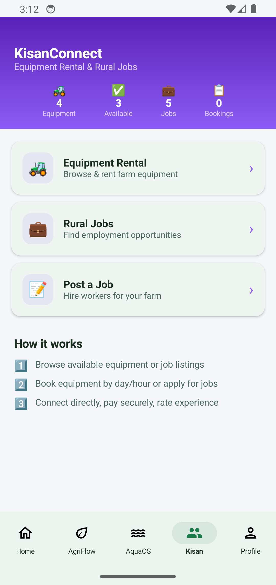 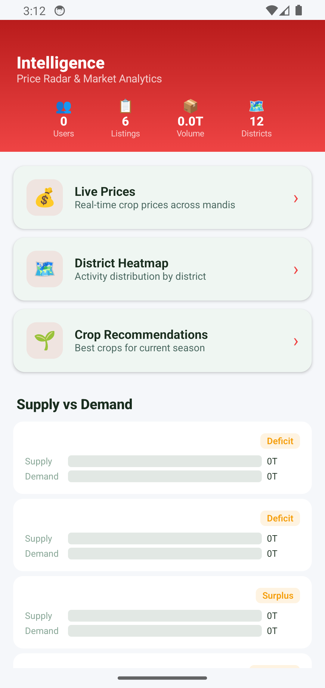

</div>

---

## 📋 Table of Contents

<details>
<summary><strong>Click to expand full table of contents</strong></summary>

- [🌾 AgriHub](#-agrihub)
- [📋 Table of Contents](#-table-of-contents)
- [🎯 Vision & Mission](#-vision--mission)
- [✨ Key Highlights](#-key-highlights)
- [🏗️ Architecture Overview](#️-architecture-overview)
  - [System Architecture Diagram](#system-architecture-diagram)
  - [Technology Stack](#technology-stack)
  - [Monorepo Structure](#monorepo-structure)
- [📱 Platform Modules](#-platform-modules)
  - [🌿 AgriFlow — Marketplace & Supply Chain](#-agriflow--marketplace--supply-chain)
  - [🐟 AquaOS — Aquaculture Management](#-aquaos--aquaculture-management)
  - [🏠 FarmerConnect — Property & Land Platform](#-farmerconnect--property--land-platform)
  - [🚜 KisanConnect — Equipment & Services](#-kisanconnect--equipment--services)
  - [🧠 Intelligence — Market Analytics](#-intelligence--market-analytics)
  - [📊 Trade Engine — B2B Commerce](#-trade-engine--b2b-commerce)
  - [🌍 AgriGalaxy — Satellite & Geo Intelligence](#-agrigalaxy--satellite--geo-intelligence)
  - [🌱 BhoomiOS — Soil Health Platform](#-bhoomios--soil-health-platform)
  - [🩺 CropDoctor — AI Disease Detection](#-cropdoctor--ai-disease-detection)
  - [📓 FarmDiary — Digital Farm Journal](#-farmdiary--digital-farm-journal)
  - [💬 Chat — Real-time Messaging](#-chat--real-time-messaging)
  - [💰 Wallet & Payments](#-wallet--payments)
  - [🎓 Training — Agri Education](#-training--agri-education)
  - [🏛️ Scheme Discovery — Government Schemes](#️-scheme-discovery--government-schemes)
  - [👥 Community — Social Platform](#-community--social-platform)
  - [☀️ Weather — Forecasts & Advisories](#️-weather--forecasts--advisories)
- [🗄️ Database Architecture](#️-database-architecture)
  - [Core Schema (40+ Tables)](#core-schema-40-tables)
  - [Migration System](#migration-system)
- [🔌 API Reference](#-api-reference)
  - [Authentication](#authentication)
  - [Marketplace (AgriFlow)](#marketplace-agriflow)
  - [Aquaculture (AquaOS)](#aquaculture-aquaos)
  - [Property (FarmerConnect)](#property-farmerconnect)
  - [Equipment (KisanConnect)](#equipment-kisanconnect)
  - [Intelligence & Analytics](#intelligence--analytics)
  - [Trade Engine](#trade-engine)
  - [Chat & Messaging](#chat--messaging)
  - [Payments & Wallet](#payments--wallet)
  - [WebSocket Events](#websocket-events)
- [⚡ Real-time Features](#-real-time-features)
- [📱 Android App (Native Kotlin)](#-android-app-native-kotlin)
  - [Architecture](#android-architecture)
  - [Screen Map](#screen-map)
  - [Build Instructions](#build-instructions)
- [🌐 Web Application](#-web-application)
- [🚀 Quick Start](#-quick-start)
  - [Option A — Docker (Recommended)](#option-a--docker-recommended)
  - [Option B — Local Development](#option-b--local-development)
  - [Option C — Android Native](#option-c--android-native)
- [⚙️ Configuration](#️-configuration)
- [🧪 Testing](#-testing)
- [🔒 Security](#-security)
- [📈 Performance](#-performance)
- [🚢 Deployment](#-deployment)
  - [CI/CD Pipeline](#cicd-pipeline)
  - [Docker Production](#docker-production)
  - [Vercel (Web Frontend)](#vercel-web-frontend)
- [📸 Screenshots & UI Showcase](#-screenshots--ui-showcase)
- [🗺️ Roadmap](#-roadmap)
- [🤝 Contributing](#-contributing)
- [📄 License](#-license)

</details>

---

## 🎯 Vision & Mission

<table>
<tr>
<td width="50%">

### 🎯 Vision
**Democratize agricultural technology** to empower every Indian farmer — from smallholder to FPO — with enterprise-grade tools for price discovery, supply chain transparency, and market access.

</td>
<td width="50%">

### 🚀 Mission
Build a **unified super-app ecosystem** that eliminates information asymmetry in Indian agriculture, enabling:
- 📊 Real-time price discovery across 12+ districts
- 🤝 Direct farmer-to-buyer connections
- 🐟 Precision aquaculture management
- 🚜 Equipment sharing economy
- 🧠 AI-driven agricultural intelligence

</td>
</tr>
</table>

---

## ✨ Key Highlights

<table>
<tr>
<td align="center" width="25%">
<h3>🏗️</h3>
<strong>Production Architecture</strong><br>
<sub>Docker · PostgreSQL · Redis · WebSocket · JWT · Rate Limiting · Helmet</sub>
</td>
<td align="center" width="25%">
<h3>📱</h3>
<strong>Native Android</strong><br>
<sub>Kotlin · Jetpack Compose · Material 3 · Hilt DI · Room DB · WorkManager</sub>
</td>
<td align="center" width="25%">
<h3>⚡</h3>
<strong>Real-time Engine</strong><br>
<sub>WebSocket price ticker (5s) · Live activity feed · Chat · Typing indicators</sub>
</td>
<td align="center" width="25%">
<h3>🔒</h3>
<strong>Enterprise Security</strong><br>
<sub>OTP Auth · JWT + Refresh · RBAC · Rate Limit · HPP · Input Sanitization</sub>
</td>
</tr>
<tr>
<td align="center" width="25%">
<h3>📊</h3>
<strong>16 Platform Modules</strong><br>
<sub>AgriFlow · AquaOS · KisanConnect · FarmerConnect · Intelligence · Trade · + 10 more</sub>
</td>
<td align="center" width="25%">
<h3>🗄️</h3>
<strong>40+ Database Tables</strong><br>
<sub>4 migration versions · Triggers · Indexes · JSONB · GIS-ready · Enums</sub>
</td>
<td align="center" width="25%">
<h3>🌐</h3>
<strong>35+ API Routes</strong><br>
<sub>100+ endpoints · Pagination · Filtering · Search · Validation · Error handling</sub>
</td>
<td align="center" width="25%">
<h3>🚀</h3>
<strong>Full CI/CD</strong><br>
<sub>GitHub Actions · Lint · Test · Build · Deploy Preview · Vercel Production</sub>
</td>
</tr>
</table>

---

## 🏗️ Architecture Overview

### System Architecture Diagram

```
┌─────────────────────────────────────────────────────────────────────────────────┐
│                              CLIENT LAYER                                        │
├───────────────────────┬────────────────────────┬────────────────────────────────┤
│   📱 Android Native    │    🌐 Web (Vite SPA)    │    📊 Admin Dashboard           │
│   Kotlin + Compose     │    Vanilla JS + CSS     │    (Future)                    │
│   Material 3 + Hilt    │    PWA + Service Worker │                                │
└───────────┬───────────┴──────────┬─────────────┴────────────────┬───────────────┘
            │                      │                              │
            ▼                      ▼                              ▼
┌─────────────────────────────────────────────────────────────────────────────────┐
│                          🔀 API GATEWAY LAYER                                    │
│   Express.js 4.21 · Helmet · CORS · Rate Limiting · HPP · Morgan · Pino        │
│   Request ID · Input Sanitization · JWT Verification · Error Handler            │
└──────────────────────────────────────┬──────────────────────────────────────────┘
                                       │
            ┌──────────────────────────┼──────────────────────────┐
            ▼                          ▼                          ▼
┌───────────────────┐    ┌──────────────────────┐    ┌────────────────────────┐
│  🔐 AUTH SERVICE   │    │  📡 WEBSOCKET SERVER  │    │  ⏰ SCHEDULER SERVICE   │
│  OTP + JWT + RBAC  │    │  Price Ticker (5s)   │    │  Cron: price feeds     │
│  Refresh Tokens    │    │  Activity Push       │    │  Auto-expiry cleanup   │
│  Role Middleware    │    │  Chat Messages       │    │  Advisory generation   │
└───────────────────┘    │  Typing Indicators   │    └────────────────────────┘
                          └──────────────────────┘
                                       │
┌─────────────────────────────────────────────────────────────────────────────────┐
│                          📦 BUSINESS LOGIC LAYER                                 │
├────────┬─────────┬──────────┬──────────┬───────────┬──────────┬────────────────┤
│AgriFlow│ AquaOS  │  Kisan   │ Farmer   │  Intel    │  Trade   │ +10 modules    │
│Listings│ Ponds   │Equipment │Properties│Prices     │ Orders   │ Chat, Wallet   │
│Inquiry │ Quality │Bookings  │Filters   │Heatmaps   │ Escrow   │ Weather, etc.  │
│Declare │Advisory │Jobs      │Search    │Forecasts  │Agreements│                │
└────────┴─────────┴──────────┴──────────┴───────────┴──────────┴────────────────┘
                                       │
┌─────────────────────────────────────────────────────────────────────────────────┐
│                           🗄️ DATA LAYER                                          │
├──────────────────────────────┬──────────────────────────────────────────────────┤
│   PostgreSQL 15              │   Redis 7                                         │
│   • 40+ tables              │   • Session caching                               │
│   • 4 migration versions    │   • Rate limit counters                           │
│   • Triggers & functions    │   • WebSocket pub/sub                             │
│   • GIN indexes for JSONB   │   • OTP temporary storage                         │
│   • UUID primary keys       │   • Price feed cache                              │
└──────────────────────────────┴──────────────────────────────────────────────────┘
```

### Technology Stack

| Layer | Technology | Version | Purpose |
|:------|:-----------|:--------|:--------|
| **Backend Runtime** | Node.js | 20 LTS | Server-side JavaScript runtime |
| **API Framework** | Express.js | 4.21 | REST API routing, middleware pipeline |
| **Database** | PostgreSQL | 15-alpine | Primary relational data store |
| **Cache & Pub/Sub** | Redis | 7-alpine | Caching, rate limiting, session store |
| **Real-time** | ws (WebSocket) | 8.18 | Bi-directional communication |
| **Auth** | jsonwebtoken | 9.0 | JWT access + refresh token system |
| **Validation** | express-validator | 7.2 | Request body/query/param validation |
| **Security** | helmet + hpp | 8.0 / 0.2 | HTTP headers, parameter pollution |
| **Logging** | Pino + pino-http | 10.3 | Structured JSON logging |
| **Android** | Kotlin | 1.9 | Native Android development |
| **UI Framework** | Jetpack Compose | Material 3 | Declarative UI with theming |
| **DI** | Hilt (Dagger) | Latest | Dependency injection |
| **Local DB** | Room | Latest | Offline-first SQLite |
| **Background** | WorkManager | Latest | Offline sync, background tasks |
| **Web Frontend** | Vite | 6.3 | Lightning-fast HMR, bundling |
| **Containerization** | Docker Compose | v2 | Multi-service orchestration |
| **CI/CD** | GitHub Actions | v4 | Automated test, build, deploy |
| **Hosting** | Vercel | Edge | Web frontend production hosting |

### Monorepo Structure

```
AgriHub/
│
├── 📱 android/                          ← Native Android App (Kotlin + Compose)
│   ├── app/
│   │   ├── build.gradle.kts            Gradle build config (SDK 34, Hilt, Room)
│   │   └── src/main/
│   │       ├── AndroidManifest.xml     Permissions, activities
│   │       └── java/com/agrihub/app/
│   │           ├── AgriHubApp.kt       Application class (Hilt entry)
│   │           ├── MainActivity.kt     Single-activity Compose host
│   │           ├── data/
│   │           │   ├── api/ApiService.kt       Retrofit API interface
│   │           │   ├── local/AppDatabase.kt    Room database (offline)
│   │           │   ├── model/Models.kt         Data classes (40+ models)
│   │           │   └── repository/             Repository pattern
│   │           ├── di/AppModule.kt     Hilt dependency modules
│   │           ├── ui/
│   │           │   ├── agriflow/       Marketplace screens
│   │           │   ├── aquaos/         Pond management screens
│   │           │   ├── auth/           Login, OTP, onboarding
│   │           │   ├── buyer/          Buyer-specific views
│   │           │   ├── community/      Social features
│   │           │   ├── components/     Shared UI components
│   │           │   ├── farmer/         Farmer role screens
│   │           │   ├── farmerconnect/  Property listings
│   │           │   ├── fpo/            FPO management
│   │           │   ├── home/           Dashboard
│   │           │   ├── intelligence/   Analytics & charts
│   │           │   ├── kisanconnect/   Equipment rental
│   │           │   ├── navigation/     Nav graph + shared VM
│   │           │   ├── notifications/  Alert center
│   │           │   ├── onboarding/     First-run wizard
│   │           │   ├── orders/         Order tracking
│   │           │   ├── profile/        User profile
│   │           │   ├── theme/          Material 3 theming
│   │           │   └── weather/        Weather dashboard
│   │           ├── util/
│   │           │   ├── ImageUtils.kt   Compress, upload helpers
│   │           │   └── TokenManager.kt JWT storage (DataStore)
│   │           └── workers/
│   │               └── OfflineSyncWorker.kt  Background data sync
│   └── gradle/                         Gradle wrapper
│
├── 🖥️ backend/                          ← Node.js REST API + WebSocket Server
│   ├── Dockerfile                      Multi-stage production build
│   ├── package.json                    Dependencies & scripts
│   ├── setup-db.js                     One-command DB provisioning
│   └── src/
│       ├── index.js                    Server bootstrap (migrate → seed → listen)
│       ├── scheduler.js                Cron jobs (price feeds, expiry)
│       ├── db/
│       │   ├── pool.js                 pg connection pool + retry
│       │   ├── migrate.js             V1: Foundation schema (15 tables)
│       │   ├── migrate-v2.js          V2: Platform expansion (20+ tables)
│       │   ├── migrate-v3-trade.js    V3: Trade engine (orders, escrow)
│       │   ├── migrate-v4-infrastructure.js  V4: Infrastructure
│       │   ├── seed.js                Demo data (crops, districts, users)
│       │   └── transaction.js         Transaction helper utility
│       ├── lib/
│       │   ├── config.js              Centralized env config
│       │   ├── errors.js              Custom error classes
│       │   └── logger.js              Pino structured logger
│       ├── middleware/
│       │   ├── auth.js                JWT verify + role-based access
│       │   ├── errorHandler.js        Global error → JSON response
│       │   ├── requestId.js           UUID per request (tracing)
│       │   └── sanitize.js            XSS/injection prevention
│       ├── routes/                     ← 35 route modules (10,786 lines)
│       │   ├── auth.js                OTP send/verify, JWT refresh, me
│       │   ├── agriflow.js            Listings, inquiries, declarations
│       │   ├── aquaos.js              Ponds, water quality, cycles
│       │   ├── farmerconnect.js       Property CRUD + advanced filters
│       │   ├── kisanconnect.js        Equipment, bookings, services
│       │   ├── intelligence.js        Prices, heatmaps, forecasts
│       │   ├── trade.js               Orders, negotiations, contracts
│       │   ├── chat.js                Conversations, messages, read receipts
│       │   ├── wallet.js              Balance, transactions, top-up
│       │   ├── weather.js             Forecasts, alerts, historical
│       │   ├── payments.js            Razorpay integration, refunds
│       │   ├── community.js           Posts, comments, likes
│       │   ├── training.js            Courses, videos, certificates
│       │   ├── schemediscovery.js     Gov scheme matching
│       │   ├── cropdoctor.js          Disease detection, remedies
│       │   ├── escrow.js              Secure payment holding
│       │   ├── fpo.js                 FPO operations, members
│       │   ├── buyer.js               Buyer-specific endpoints
│       │   ├── farmer.js              Farmer profile, farm data
│       │   ├── orders.js              Order lifecycle
│       │   ├── admin.js               Admin operations
│       │   ├── upload.js              File/image upload (S3-ready)
│       │   ├── reviews.js             Ratings & reviews
│       │   ├── favorites.js           Wishlist/bookmarks
│       │   ├── watchlists.js          Price/crop alerts
│       │   ├── subscriptions.js       Premium tier management
│       │   ├── tickets.js             Support ticket system
│       │   ├── jobs.js                Job board CRUD
│       │   ├── notifications.js       Push notification management
│       │   ├── tracking.js            Order/delivery tracking
│       │   ├── translate.js           Multi-language support
│       │   ├── agrigalaxy.js          Satellite data integration
│       │   ├── bhoomios.js            Soil health management
│       │   ├── farmdiary.js           Farm activity journal
│       │   ├── schemes.js             Government scheme data
│       │   └── health.js              Health check endpoints
│       └── services/
│           ├── websocket.js           WS server (price, activity, chat)
│           ├── weather.js             Weather API integration
│           ├── sms.js                 OTP delivery (MSG91/Twilio)
│           ├── push.js                FCM push notifications
│           ├── payments.js            Payment gateway adapter
│           ├── storage.js             S3-compatible file storage
│           ├── translate.js           Translation service
│           ├── queue.js               Job queue (Bull/Redis)
│           └── apmc.js                APMC mandi price scraper
│
├── 🌐 src/                              ← Web Frontend (Vite + Vanilla JS)
│   ├── main.js                         App entry, router, screen loader
│   ├── api.js                          HTTP client + auth interceptors
│   ├── store.js                        State management (reactive store)
│   ├── i18n.js                         Internationalization (Telugu, Hindi)
│   ├── app-shell.js                    App shell, navigation, layout
│   ├── screens/                        ← 25+ screen modules
│   │   ├── HomeScreen.js              Dashboard with live data
│   │   ├── LoginScreen.js             Phone OTP authentication
│   │   ├── AgriFlowScreen.js          Marketplace interface
│   │   ├── AquaOSScreen.js            Aquaculture dashboard
│   │   ├── FarmerConnectScreen.js     Property search
│   │   ├── KisanConnectScreen.js      Equipment booking
│   │   ├── IntelligenceScreen.js      Analytics & charts
│   │   ├── ChatScreen.js              Messaging interface
│   │   ├── WalletScreen.js            Digital wallet
│   │   ├── OrdersScreen.js            Order management
│   │   ├── CommunityScreen.js         Social features
│   │   ├── WeatherScreen.js           Weather dashboard
│   │   ├── ProfileScreen.js           User settings
│   │   └── ... (12 more screens)
│   ├── components/ui.js               Reusable UI component library
│   ├── integrations/
│   │   ├── maps.js                    Google Maps integration
│   │   └── payments.js                Razorpay checkout
│   ├── utils/
│   │   ├── errors.js                  Error boundary utilities
│   │   ├── offline.js                 Service worker + cache
│   │   ├── perf.js                    Performance monitoring
│   │   └── pullRefresh.js             Pull-to-refresh gesture
│   └── styles/                         CSS architecture
│       ├── variables.css              Design tokens
│       ├── base.css                   Reset + typography
│       ├── components.css             UI component styles
│       ├── pages.css                  Page-specific styles
│       ├── animations.css             Micro-interactions
│       └── functional.css             Utility classes
│
├── 🗄️ supabase/migrations/             ← Database Migrations (reference)
│   ├── 001_foundation.sql             Core tables, triggers, seed
│   └── 002_complete_platform.sql      Full platform (payments, chat, etc.)
│
├── 🧪 tests/                            ← Test Suite
│   ├── errors.test.js                 Error handling tests
│   ├── perf.test.js                   Performance benchmarks
│   └── ui.test.js                     UI component tests
│
├── 🐳 docker-compose.yml               Three-service orchestration
├── 📋 package.json                      Root workspace config
├── ⚡ vite.config.js                    Build tool configuration
├── 🌍 vercel.json                       Deployment configuration
├── 📄 .env.example                      Environment template
└── 🔄 .github/workflows/ci.yml         CI/CD pipeline (6 jobs)
```

---

## 📱 Platform Modules

AgriHub consists of **16 integrated platform modules**, each addressing a specific need in the agricultural value chain:

### 🌿 AgriFlow — Marketplace & Supply Chain

<table>
<tr><td width="70%">

**The core marketplace connecting farmers, FPOs, and buyers.**

| Feature | Description |
|:--------|:------------|
| 📦 Supply Listings | Create/browse crop listings with photos, grades, prices |
| 🤝 Inquiry System | Buyer → Seller negotiation thread |
| 📋 Declarations | Farmer crop planting declarations (sow/harvest dates) |
| 🌾 Crop Catalog | 15+ crops with variety info, emoji icons, regional names |
| 📍 District Mapping | 12 AP districts with geolocation |
| 🔍 Advanced Search | Multi-filter (crop, district, grade, price range, organic) |
| 📊 Quality Scoring | Auto-computed listing quality metrics |

**Backend:** `663 lines` · **Endpoints:** 12+ · **Tables:** 4

</td><td width="30%">

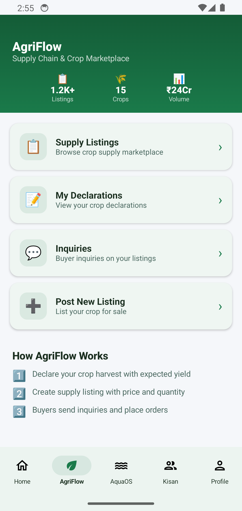

</td></tr>
</table>

---

### 🐟 AquaOS — Aquaculture Management

<table>
<tr><td width="70%">

**Precision aquaculture for pond management and water quality monitoring.**

| Feature | Description |
|:--------|:------------|
| 🏊 Pond Management | Create, track, and manage fish/shrimp ponds |
| 💧 Water Quality | Log pH, dissolved oxygen, temperature, turbidity |
| 📈 Time-series | Historical water quality tracking with trends |
| ⚠️ Advisories | Auto-generated alerts for disease/weather risks |
| 🔄 Cycle Management | Active → Harvested → Fallow pond lifecycle |
| 📊 Survival Rates | Track stocking density vs. harvest yield |
| 🌡️ Thresholds | Configurable alerts when params exceed safe ranges |

**Backend:** `1,129 lines` · **Endpoints:** 15+ · **Tables:** 3

</td><td width="30%">


</td></tr>
</table>

---

### 🏠 FarmerConnect — Property & Land Platform

<table>
<tr><td width="70%">

**Agricultural land, rental properties, and PG accommodation marketplace.**

| Feature | Description |
|:--------|:------------|
| 🏘️ Property Listings | Apartments, agri land, PG, commercial |
| 🔍 25+ Filters | BHK, furnishing, area, floor, amenities, irrigation |
| 📸 Photo Carousel | Multi-image property galleries |
| ❤️ Favorites | Save and compare properties |
| 📞 Inquiry Form | Direct contact with property owners |
| 🌾 Agri-specific | Soil type, water source, irrigation filters |
| ✅ Verified Badges | Verified property listings |

**Backend:** `386 lines` · **Endpoints:** 8+ · **Tables:** 1

</td><td width="30%">

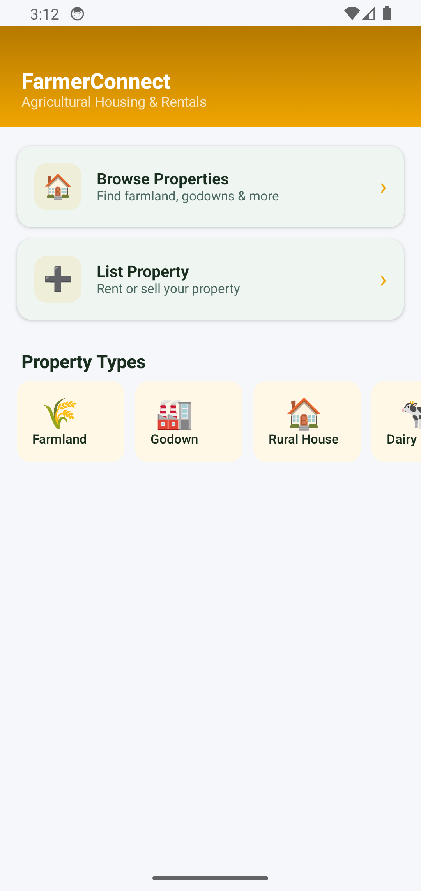

</td></tr>
</table>

---

### 🚜 KisanConnect — Equipment & Services

<table>
<tr><td width="70%">

**Equipment rental, rural services marketplace, and agricultural job board.**

| Feature | Description |
|:--------|:------------|
| 🚜 Equipment Catalog | Tractors, harvesters, tillers, sprayers, drones |
| 📅 Booking System | Date-based rental with auto cost calculation |
| 🛠️ Rural Services | 12 categories (plumber, vet, drone spray, cold storage) |
| ⭐ Reviews & Ratings | Service provider reputation system |
| 💼 Job Board | Post and apply for agricultural jobs |
| 📍 Proximity Search | Find equipment/services near your location |
| 💰 Payment Integration | Online booking payments |

**Backend:** `1,083 lines` · **Endpoints:** 20+ · **Tables:** 3

</td><td width="30%">


</td></tr>
</table>

---

### 🧠 Intelligence — Market Analytics

<table>
<tr><td width="70%">

**Real-time market intelligence with price feeds, supply forecasts, and heatmaps.**

| Feature | Description |
|:--------|:------------|
| 📊 Live Prices | 8+ commodity prices via WebSocket (5s refresh) |
| 🗺️ District Heatmap | Supply/demand visualization by geography |
| 📈 Price Trends | Historical price charts with line graphs |
| 🔮 Forecasts | 30/60/90-day harvest predictions |
| ⚖️ Supply vs Demand | Side-by-side comparison bars |
| 🏪 APMC Mandi Prices | Scraped real market prices |
| 📉 Crop Analytics | Per-crop intelligence reports |

**Backend:** `496 lines` · **Endpoints:** 10+ · **Tables:** 2

</td><td width="30%">


</td></tr>
</table>

---

### 📊 Trade Engine — B2B Commerce

| Feature | Description |
|:--------|:------------|
| 📝 Order Lifecycle | Create → Negotiate → Accept → Ship → Deliver → Complete |
| 🔒 Escrow Payments | Secure payment holding until delivery confirmation |
| 📄 Trade Agreements | Digital contracts with e-signature support |
| 💬 Negotiation | Structured offer/counter-offer system |
| 🚚 Shipment Tracking | Real-time logistics visibility |
| 📊 Trade Analytics | Volume, revenue, partner performance |

**Backend:** `706 lines` · **Endpoints:** 15+

---

### 🌍 AgriGalaxy — Satellite & Geo Intelligence

| Feature | Description |
|:--------|:------------|
| 🛰️ Satellite Imagery | NDVI, crop health from satellite data |
| 📍 Farm Boundary | GPS polygon-based farm mapping |
| 🌿 Crop Health Index | Remote sensing vegetation analysis |
| 📊 Yield Estimation | AI-based yield prediction from imagery |

**Backend:** `210 lines`

---

### 🌱 BhoomiOS — Soil Health Platform

| Feature | Description |
|:--------|:------------|
| 🧪 Soil Testing | NPK, pH, organic carbon analysis |
| 📋 Health Cards | Digital soil health card system |
| 💊 Recommendations | Fertilizer dosage recommendations |
| 📈 Historical Trends | Soil health change tracking |

**Backend:** `200 lines`

---

### 🩺 CropDoctor — AI Disease Detection

| Feature | Description |
|:--------|:------------|
| 📸 Image Diagnosis | Upload leaf photo → disease identification |
| 💊 Remedy Database | Treatment recommendations per disease |
| 📚 Disease Library | Comprehensive crop disease encyclopedia |
| 🔔 Outbreak Alerts | Regional disease spread notifications |

**Backend:** `506 lines`

---

### 📓 FarmDiary — Digital Farm Journal

| Feature | Description |
|:--------|:------------|
| 📝 Activity Logging | Daily farm operations tracking |
| 💰 Expense Tracking | Input costs, labor, transport |
| 🌱 Crop Timeline | Sow → Grow → Harvest lifecycle |
| 📊 Season Reports | P&L per crop per season |

**Backend:** `282 lines`

---

### 💬 Chat — Real-time Messaging

| Feature | Description |
|:--------|:------------|
| 💬 1:1 Conversations | Direct messaging between users |
| 📎 Rich Messages | Text, images, files, location, offers |
| ✓✓ Read Receipts | Real-time read status via WebSocket |
| ⌨️ Typing Indicators | Live typing status |
| 🔗 Context Linking | Chat from listing/property/equipment |
| 🔍 Message Search | Full-text search across conversations |

**Backend:** `446 lines`

---

### 💰 Wallet & Payments

| Feature | Description |
|:--------|:------------|
| 💳 Digital Wallet | In-app balance with transaction history |
| 🏦 Top-up | Bank transfer, UPI, card payments |
| 💸 P2P Transfer | Farmer ↔ FPO ↔ Buyer transfers |
| 🧾 Payment Orders | Razorpay gateway integration |
| 🔒 Escrow | Secure holding for trade payments |
| 📊 Statements | Monthly/annual financial reports |

**Backend:** `460 + 252 + 192 lines`

---

### 🎓 Training — Agri Education

| Feature | Description |
|:--------|:------------|
| 🎥 Video Courses | Farming technique tutorials |
| 📚 Modules | Structured learning paths |
| 🏆 Certificates | Completion certificates |
| 🌐 Multi-language | Content in Telugu, Hindi, English |

**Backend:** `245 lines`

---

### 🏛️ Scheme Discovery — Government Schemes

| Feature | Description |
|:--------|:------------|
| 🔍 Smart Matching | Auto-match schemes to farmer profile |
| 📋 Eligibility Check | Role + landholding + location criteria |
| 📄 Application Help | Step-by-step application guidance |
| 🔔 Deadline Alerts | Upcoming scheme deadline notifications |

**Backend:** `429 lines`

---

### 👥 Community — Social Platform

| Feature | Description |
|:--------|:------------|
| 📝 Posts & Discussions | Farm-related social sharing |
| 💬 Comments & Replies | Threaded conversations |
| ❤️ Likes & Reactions | Engagement system |
| 👤 Farmer Profiles | Community reputation |

**Backend:** `245 lines`

---

### ☀️ Weather — Forecasts & Advisories

| Feature | Description |
|:--------|:------------|
| 🌤️ 7-Day Forecast | Location-based weather predictions |
| 🌧️ Rain Alerts | Precipitation warnings |
| 🌡️ Historical Data | Temperature/humidity trends |
| 🌾 Crop Advisories | Weather-based farming recommendations |

**Backend:** `485 lines`

---

## 🗄️ Database Architecture

### Core Schema (40+ Tables)

AgriHub uses a **progressive migration system** spanning 4 versions:

<details>
<summary><strong>📋 V1 — Foundation (15 tables)</strong></summary>

| Table | Description | Key Columns |
|:------|:------------|:------------|
| `users` | All platform users | id, phone, name, role, district_id, is_verified |
| `otps` | Phone verification codes | phone, code, expires_at, verified |
| `refresh_tokens` | JWT refresh tokens | user_id, token, expires_at |
| `crop_catalog` | Crop master data | name, name_te, name_hi, icon_emoji, category |
| `districts` | Geographic regions | name, state, latitude, longitude |
| `declarations` | Planting declarations | user_id, crop_id, area_acres, sow_date, harvest_date |
| `supply_listings` | Marketplace listings | user_id, crop_id, quantity_kg, price_per_kg, grade |
| `inquiries` | Buyer inquiries | buyer_id, listing_id, message, status |
| `price_feeds` | Market prices | crop_id, district_id, price, source, recorded_at |
| `ponds` | Aquaculture ponds | user_id, name, area_hectares, species, status |
| `water_quality_logs` | Water parameters | pond_id, ph, dissolved_oxygen, temperature |
| `advisories` | System advisories | title, severity, category, affected_districts |
| `properties` | Real estate listings | title, type, price, area_sqft, bhk, amenities |
| `equipment` | Rental equipment | name, type, rate_per_hour, owner_id, available |
| `equipment_bookings` | Rental bookings | equipment_id, user_id, start_date, end_date, cost |

</details>

<details>
<summary><strong>📋 V2 — Platform Expansion (20+ tables)</strong></summary>

| Table | Description |
|:------|:------------|
| `payment_orders` | Payment gateway transactions |
| `conversations` | Chat conversation pairs |
| `messages` | Chat message history |
| `subscription_plans` | Premium tier definitions |
| `user_subscriptions` | Active subscriptions |
| `reviews` | Ratings & text reviews |
| `favorites` | User bookmarks/wishlist |
| `watchlists` | Price/crop alert rules |
| `support_tickets` | Customer support tickets |
| `ticket_messages` | Support thread messages |
| `community_posts` | Social feed posts |
| `community_comments` | Post comments |
| `community_likes` | Engagement metrics |
| `training_courses` | Educational content |
| `training_modules` | Course modules |
| `user_progress` | Learning progress |
| `certificates` | Completion certificates |
| `government_schemes` | Scheme catalog |
| `scheme_applications` | User applications |
| `farm_diary_entries` | Farm activity log |
| `crop_diseases` | Disease encyclopedia |
| `diagnosis_history` | AI diagnosis results |

</details>

<details>
<summary><strong>📋 V3 — Trade Engine</strong></summary>

| Table | Description |
|:------|:------------|
| `trade_orders` | B2B order lifecycle |
| `trade_negotiations` | Offer/counter-offer chain |
| `trade_agreements` | Digital contracts |
| `escrow_accounts` | Secure payment holding |
| `escrow_transactions` | Escrow fund movements |
| `shipments` | Logistics tracking |

</details>

<details>
<summary><strong>📋 V4 — Infrastructure</strong></summary>

| Table | Description |
|:------|:------------|
| `wallet_accounts` | User wallet balances |
| `wallet_transactions` | Debit/credit history |
| `push_tokens` | FCM device tokens |
| `notification_queue` | Queued notifications |
| `user_kyc` | KYC verification levels |
| `api_keys` | Third-party API keys |

</details>

### Migration System

```bash
# Run all migrations sequentially
npm run migrate

# Or individually:
npm run migrate:v2    # Platform expansion
npm run migrate:v3    # Trade engine
npm run migrate:v4    # Infrastructure

# Auto-migration on startup:
npm start    # Runs migrate → seed → server
```

---

## 🔌 API Reference

> **Base URL:** `http://localhost:4000/api`  
> **Auth:** Bearer token via `Authorization: Bearer <jwt>` header  
> **Format:** JSON request/response  
> **Pagination:** `?page=1&limit=20` on list endpoints

### Authentication

| Method | Endpoint | Auth | Description |
|:-------|:---------|:-----|:------------|
| `POST` | `/auth/send-otp` | ❌ | Send OTP to phone number |
| `POST` | `/auth/verify-otp` | ❌ | Verify OTP → returns JWT |
| `POST` | `/auth/refresh` | ❌ | Refresh expired access token |
| `GET` | `/auth/me` | ✅ | Get current user profile |
| `PATCH` | `/auth/profile` | ✅ | Update user profile |

<details>
<summary><strong>Request/Response Examples</strong></summary>

```json
// POST /auth/send-otp
{ "phone": "9876543210" }
// → { "success": true, "message": "OTP sent" }

// POST /auth/verify-otp
{ "phone": "9876543210", "code": "123456", "role": "farmer" }
// → { "token": "eyJ...", "refreshToken": "...", "user": {...} }
```

</details>

---

### Marketplace (AgriFlow)

| Method | Endpoint | Auth | Description |
|:-------|:---------|:-----|:------------|
| `GET` | `/agriflow/listings` | 🔓 | Browse supply listings (paginated, filterable) |
| `GET` | `/agriflow/listings/:id` | 🔓 | Get listing detail |
| `POST` | `/agriflow/listings` | ✅ | Create new supply listing |
| `PATCH` | `/agriflow/listings/:id` | ✅ | Update listing |
| `DELETE` | `/agriflow/listings/:id` | ✅ | Remove listing |
| `GET` | `/agriflow/inquiries` | ✅ | List inquiries (sent/received) |
| `POST` | `/agriflow/inquiries` | ✅ | Create buyer inquiry |
| `PATCH` | `/agriflow/inquiries/:id` | ✅ | Respond to inquiry |
| `GET` | `/agriflow/declarations` | ✅ | List crop declarations |
| `POST` | `/agriflow/declarations` | ✅ | Submit planting declaration |
| `GET` | `/agriflow/crops` | 🔓 | Crop catalog |
| `GET` | `/agriflow/districts` | 🔓 | District list |

**Query Parameters for Listings:**
```
?crop_id=uuid&district_id=uuid&grade=A&min_price=50&max_price=200
&organic=true&sort=price_asc&page=1&limit=20
```

---

### Aquaculture (AquaOS)

| Method | Endpoint | Auth | Description |
|:-------|:---------|:-----|:------------|
| `GET` | `/aquaos/ponds` | ✅ | List user's ponds |
| `POST` | `/aquaos/ponds` | ✅ | Create new pond |
| `GET` | `/aquaos/ponds/:id` | ✅ | Get pond detail with logs |
| `PATCH` | `/aquaos/ponds/:id` | ✅ | Update pond info |
| `POST` | `/aquaos/ponds/:id/water-log` | ✅ | Log water quality reading |
| `GET` | `/aquaos/ponds/:id/logs` | ✅ | Get historical logs |
| `POST` | `/aquaos/ponds/:id/harvest` | ✅ | Record harvest |
| `GET` | `/aquaos/advisories` | 🔓 | Active advisories |
| `GET` | `/aquaos/stats` | ✅ | Dashboard statistics |

---

### Property (FarmerConnect)

| Method | Endpoint | Auth | Description |
|:-------|:---------|:-----|:------------|
| `GET` | `/farmerconnect/properties` | 🔓 | Search properties |
| `POST` | `/farmerconnect/properties` | ✅ | List a property |
| `GET` | `/farmerconnect/properties/:id` | 🔓 | Property detail |
| `PATCH` | `/farmerconnect/properties/:id` | ✅ | Update property |

**Advanced Filter Parameters:**
```
?type=apartment&bhk=2&furnishing=semi&min_area=500&max_area=2000
&floor_range=1-5&amenities=parking,gym&verified_only=true
&irrigation=drip&soil_type=black&water_source=borewell
```

---

### Equipment (KisanConnect)

| Method | Endpoint | Auth | Description |
|:-------|:---------|:-----|:------------|
| `GET` | `/kisanconnect/equipment` | 🔓 | Browse available equipment |
| `POST` | `/kisanconnect/equipment` | ✅ | List equipment for rent |
| `POST` | `/kisanconnect/bookings` | ✅ | Book equipment |
| `GET` | `/kisanconnect/bookings` | ✅ | My bookings |
| `PATCH` | `/kisanconnect/bookings/:id/status` | ✅ | Update booking status |
| `GET` | `/kisanconnect/service-categories` | 🔓 | 12 rural service categories |
| `GET` | `/kisanconnect/services/:id` | 🔓 | Service provider detail |
| `GET/POST` | `/kisanconnect/services/:id/reviews` | ✅ | Provider reviews |
| `GET` | `/kisanconnect/jobs` | 🔓 | Job board listings |
| `POST` | `/kisanconnect/jobs` | ✅ | Post a job |

---

### Intelligence & Analytics

| Method | Endpoint | Auth | Description |
|:-------|:---------|:-----|:------------|
| `GET` | `/intelligence/prices` | 🔓 | Current market prices |
| `GET` | `/intelligence/prices/history` | 🔓 | Historical price data |
| `GET` | `/intelligence/supply-demand` | 🔓 | Supply vs demand metrics |
| `GET` | `/intelligence/district-heatmap` | 🔓 | Geographic supply data |
| `GET` | `/intelligence/forecasts` | 🔓 | Harvest forecasts |
| `GET` | `/intelligence/trends` | 🔓 | Price trend analysis |

---

### Trade Engine

| Method | Endpoint | Auth | Description |
|:-------|:---------|:-----|:------------|
| `POST` | `/trade/orders` | ✅ | Create trade order |
| `GET` | `/trade/orders` | ✅ | List my orders |
| `GET` | `/trade/orders/:id` | ✅ | Order detail |
| `PATCH` | `/trade/orders/:id/status` | ✅ | Update order status |
| `POST` | `/trade/negotiate` | ✅ | Submit offer/counter |
| `POST` | `/trade/agreements` | ✅ | Create trade agreement |
| `PATCH` | `/trade/agreements/:id/sign` | ✅ | Sign agreement |

---

### Chat & Messaging

| Method | Endpoint | Auth | Description |
|:-------|:---------|:-----|:------------|
| `GET` | `/chat/conversations` | ✅ | List conversations |
| `POST` | `/chat/conversations/from-listing` | ✅ | Start chat from listing |
| `GET` | `/chat/conversations/:id/messages` | ✅ | Get message history |
| `POST` | `/chat/conversations/:id/messages` | ✅ | Send message |
| `PATCH` | `/chat/messages/read` | ✅ | Mark messages as read |

---

### Payments & Wallet

| Method | Endpoint | Auth | Description |
|:-------|:---------|:-----|:------------|
| `GET` | `/wallet/balance` | ✅ | Get wallet balance |
| `POST` | `/wallet/topup` | ✅ | Add funds |
| `POST` | `/wallet/transfer` | ✅ | P2P transfer |
| `GET` | `/wallet/transactions` | ✅ | Transaction history |
| `POST` | `/payments/create-order` | ✅ | Initiate payment |
| `POST` | `/payments/verify` | ✅ | Verify payment |
| `POST` | `/payments/refund` | ✅ | Process refund |

---

### WebSocket Events

> **Connect:** `ws://localhost:4000/ws`

```javascript
// ─── Client → Server ─────────────────────────
{ "type": "auth", "userId": "uuid" }           // Authenticate connection
{ "type": "chat_message", "to": "uuid", "content": "..." }
{ "type": "chat_typing", "conversationId": "uuid" }
{ "type": "chat_read", "messageIds": ["uuid"] }

// ─── Server → Client ─────────────────────────
{ "type": "price_update", "prices": [...] }     // Every 5 seconds
{ "type": "activity", "activities": [...] }     // Real-time feed
{ "type": "chat_message", "from": "uuid", "content": "..." }
{ "type": "chat_typing", "userId": "uuid" }     // Typing indicator
{ "type": "notification", "data": {...} }        // Push notification
```

---

## ⚡ Real-time Features

<table>
<tr>
<td width="50%">

### 📡 WebSocket Server
- **Price Ticker** — 8 commodities broadcast every **5 seconds**
- **Activity Feed** — Live events (new listings, declarations, inquiries)
- **Chat Messages** — Instant delivery with typing indicators
- **Read Receipts** — Real-time message read status
- **Notifications** — Server-pushed alerts

</td>
<td width="50%">

### 🔄 Client Features
- **Auto-reconnect** — Exponential backoff on disconnect
- **Pull-to-refresh** — Swipe-down on all data screens
- **Optimistic UI** — Instant feedback, background sync
- **Offline Queue** — Actions queued when disconnected
- **State Sync** — Zustand/Room-backed reactive stores

</td>
</tr>
</table>

---

## 📱 Android App (Native Kotlin)

### Android Architecture

```
┌─────────────────────────────────────────────────────┐
│                 UI Layer (Compose)                   │
│  Screens → Components → Theme (Material 3 Dark)     │
├─────────────────────────────────────────────────────┤
│              Navigation (Compose Nav)                │
│  SharedViewModel → NavGraph → Deep Links            │
├─────────────────────────────────────────────────────┤
│               Domain Layer                          │
│  Repository Pattern → Use Cases                     │
├─────────────────────────────────────────────────────┤
│                Data Layer                           │
│  ApiService (Retrofit) ←→ AppDatabase (Room)       │
│  TokenManager (DataStore) → OfflineSyncWorker      │
├─────────────────────────────────────────────────────┤
│                 DI (Hilt)                           │
│  AppModule → Network, Database, Repositories       │
└─────────────────────────────────────────────────────┘
```

### Screen Map

| Module | Screens | Lines |
|:-------|:--------|:------|
| 🔐 Auth | Login, OTP, Role Selection | 400+ |
| 🏠 Home | Dashboard, Metrics, Activity | 350+ |
| 🌿 AgriFlow | Listings, Detail, Create, Inquiries | 600+ |
| 🐟 AquaOS | Ponds, Water Quality, Advisories | 500+ |
| 🏠 FarmerConnect | Properties, Filters, Detail | 450+ |
| 🚜 KisanConnect | Equipment, Bookings, Jobs | 500+ |
| 🧠 Intelligence | Prices, Charts, Heatmap | 400+ |
| 👤 Profile | Settings, KYC, Preferences | 281 |
| 🔔 Notifications | Alert Center | 200+ |
| 🛒 Orders | Order List, Tracking, Detail | 354 |
| ☀️ Weather | Forecast, Alerts, Historical | 430 |
| 👥 Community | Feed, Posts, Comments | 300+ |
| 🎯 Onboarding | Welcome, Farm Setup Wizard | 300+ |
| 🏢 FPO | Member Mgmt, Procurement, Inventory | 400+ |
| 🛒 Buyer | Search, Watchlists, Analytics | 350+ |
| 👨‍🌾 Farmer | Farm Profile, Declarations | 350+ |

**Total Kotlin:** `8,424 lines` across 25+ screen files

### Build Instructions

```bash
# Debug build
cd android
./gradlew assembleDebug

# Release build (requires signing key)
./gradlew assembleRelease

# Run on connected device/emulator
./gradlew installDebug
```

**Requirements:**
- Android Studio Hedgehog+ (2023.1.1)
- JDK 17
- Android SDK 34 (minimum SDK 26)
- Kotlin 1.9+

---

## 🌐 Web Application

The web frontend is a **lightweight Vite-powered SPA** serving as a progressive web app:

| Feature | Technology |
|:--------|:-----------|
| Bundler | Vite 6.3 (sub-second HMR) |
| UI | Vanilla JS + Custom CSS Architecture |
| State | Reactive store (custom Zustand-like) |
| Auth | JWT with auto-refresh interceptors |
| Offline | Service Worker + Cache API |
| I18n | Telugu, Hindi, English |
| PWA | Manifest + installable |
| Performance | Code-splitting, lazy loading |

```bash
# Development
npm run dev          # http://localhost:5173

# Production build
npm run build        # → dist/ (Vite optimized)

# Preview production
npm run preview
```

---

## 🚀 Quick Start

### Option A — Docker (Recommended)

```bash
# Clone the repository
git clone https://github.com/hari888b8/AAA.git
cd AAA

# Copy environment template
cp .env.example .env
# Edit .env with your JWT_SECRET (min 32 chars)

# Start all services (PostgreSQL + Redis + Backend)
docker compose up -d

# Verify health
curl http://localhost:4000/health
# → {"status":"healthy","uptime":...,"database":"connected","redis":"connected"}

# View logs
docker compose logs -f backend
```

**Services started:**
| Service | Port | Purpose |
|:--------|:-----|:--------|
| PostgreSQL 15 | 5455 | Primary database |
| Redis 7 | 6399 | Cache & pub/sub |
| Backend API | 4000 | REST + WebSocket |

---

### Option B — Local Development

```bash
# Prerequisites: Node.js 20+, PostgreSQL 15+, Redis 7+

# 1. Database setup
cd backend
node setup-db.js <your-postgres-password>
# Or manually: CREATE DATABASE "Agrihub"; CREATE USER "Agrihub" WITH PASSWORD 'postgres';

# 2. Backend
npm install
cp .env.example .env    # Edit with your credentials
npm start               # Auto: migrate → seed → listen on :4000

# 3. Web frontend (new terminal)
cd ..
npm install
npm run dev             # http://localhost:5173

# 4. Run tests
npm test                # Frontend tests (Vitest)
cd backend && npm test  # Backend tests
```

---

### Option C — Android Native

```bash
# Prerequisites: Android Studio, JDK 17, SDK 34

# 1. Start backend (Option A or B above)

# 2. Open android/ in Android Studio

# 3. For emulator: API_BASE_URL defaults to http://10.0.2.2:4000
#    For device: Update API_BASE_URL in build.gradle.kts

# 4. Run on device/emulator (⯈ button in Android Studio)
```

---

## ⚙️ Configuration

### Environment Variables

<details>
<summary><strong>Backend Configuration (<code>backend/.env</code>)</strong></summary>

| Variable | Required | Default | Description |
|:---------|:---------|:--------|:------------|
| `PORT` | ❌ | `4000` | Server port |
| `NODE_ENV` | ❌ | `development` | Environment mode |
| `POSTGRES_HOST` | ✅ | `localhost` | PostgreSQL host |
| `POSTGRES_PORT` | ❌ | `5432` | PostgreSQL port |
| `POSTGRES_DB` | ✅ | `Agrihub` | Database name |
| `POSTGRES_USER` | ✅ | `Agrihub` | Database user |
| `POSTGRES_PASSWORD` | ✅ | — | Database password |
| `REDIS_HOST` | ❌ | `localhost` | Redis host |
| `REDIS_PORT` | ❌ | `6379` | Redis port |
| `JWT_SECRET` | ✅ | — | Min 32 chars, for token signing |
| `JWT_EXPIRY` | ❌ | `7d` | Token expiration |
| `CORS_ORIGIN` | ❌ | `*` | Allowed origins |
| `SMS_PROVIDER` | ❌ | `mock` | OTP provider (mock/msg91/twilio) |
| `S3_BUCKET` | ❌ | — | File upload bucket |
| `RAZORPAY_KEY` | ❌ | — | Payment gateway key |
| `FCM_SERVER_KEY` | ❌ | — | Push notification key |

</details>

<details>
<summary><strong>Android Configuration</strong></summary>

| File | Variable | Description |
|:-----|:---------|:------------|
| `build.gradle.kts` | `API_BASE_URL` | Backend API URL |
| `local.properties` | `sdk.dir` | Android SDK path |

**Emulator:** Uses `10.0.2.2:4000` (routes to host machine)  
**Physical Device:** Use machine's LAN IP (e.g., `192.168.1.105:4000`)

</details>

---

## 🧪 Testing

```bash
# ─── Frontend Tests (Vitest) ─────────────────
npm test                    # Run all tests
npm run test:watch          # Watch mode

# ─── Backend Tests (Node.js native) ──────────
cd backend
npm test                    # All backend tests
npm run test:trade          # Trade flow integration tests

# ─── Test Coverage ────────────────────────────
# Tests cover:
# • Error handling & boundary conditions
# • Performance benchmarks
# • UI component rendering
# • Trade order lifecycle
# • API endpoint validation
```

---

## 🔒 Security

AgriHub implements **defense-in-depth** security:

| Layer | Implementation |
|:------|:---------------|
| **Transport** | HTTPS enforced in production |
| **Headers** | Helmet.js (CSP, HSTS, X-Frame, etc.) |
| **Authentication** | Phone OTP → JWT (short-lived) + Refresh Token |
| **Authorization** | Role-based access control (farmer/fpo/buyer/admin) |
| **Input Validation** | express-validator on all endpoints |
| **Sanitization** | XSS prevention, SQL injection protection |
| **Rate Limiting** | express-rate-limit (per-IP, per-user) |
| **Parameter Pollution** | HPP middleware |
| **CORS** | Restricted origins in production |
| **Secrets** | Environment variables, never committed |
| **Dependencies** | Regular `npm audit` in CI |
| **File Upload** | Type validation, size limits, path containment |
| **Tokens** | JWT with configurable expiry, refresh rotation |

---

## 📈 Performance

| Metric | Value | Implementation |
|:-------|:------|:---------------|
| **API Response** | < 100ms p95 | Connection pooling, indexed queries |
| **WebSocket Latency** | < 50ms | Direct WS push, no polling |
| **Bundle Size** | ~3.67 MB (Android) | ProGuard minification |
| **Web Bundle** | < 500 KB | Vite tree-shaking, code-splitting |
| **DB Queries** | Optimized | Composite indexes, prepared statements |
| **Compression** | Enabled | gzip/brotli via compression middleware |
| **Caching** | Redis | Price feeds, session data, OTPs |

---

## 🚢 Deployment

### CI/CD Pipeline

```yaml
GitHub Actions (6 Jobs):
  ┌─────────┐     ┌──────────────┐     ┌───────────┐
  │ 🔍 Lint  │────▶│ 🧪 Test (FE)  │────▶│ 🏗️ Build   │
  └─────────┘     └──────────────┘     └─────┬─────┘
                                              │
       ┌──────────────────┐                   ▼
       │ 🔧 Backend Valid  │      ┌──────────────────────┐
       └──────────────────┘      │ 🚀 Deploy Preview (PR)│
                                  │ 🌍 Deploy Prod (main) │
                                  └──────────────────────┘
```

**Triggers:** Push to `main`/`develop`, Pull Requests to `main`

---

### Docker Production

```bash
# Production deployment
docker compose -f docker-compose.yml up -d

# Scale backend
docker compose up -d --scale backend=3

# Health monitoring
curl http://your-server:4000/health
```

---

### Vercel (Web Frontend)

The web frontend auto-deploys to Vercel:
- **Preview:** Every PR gets a unique preview URL
- **Production:** Merges to `main` deploy to production
- **Config:** `vercel.json` with SPA rewrites

---

## 📸 Screenshots & UI Showcase

<div align="center">

### 🔐 Authentication Flow
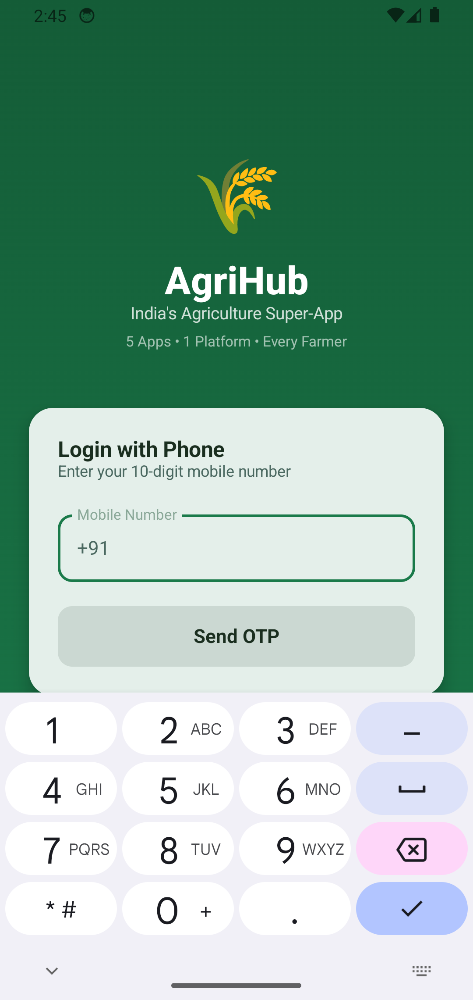 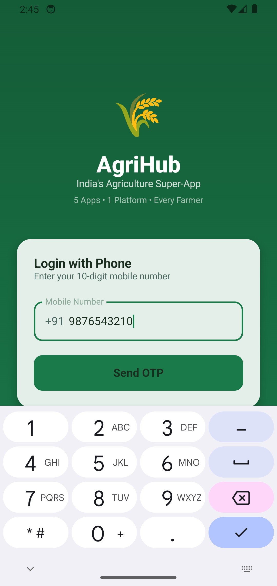 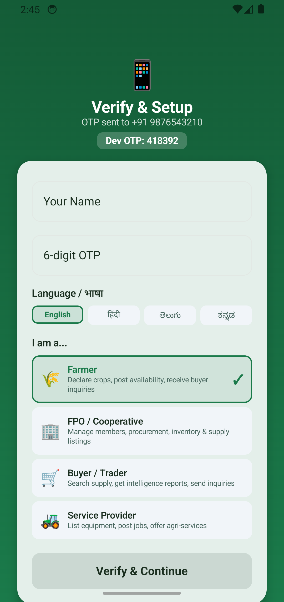  

### 🏠 Home & Dashboard
  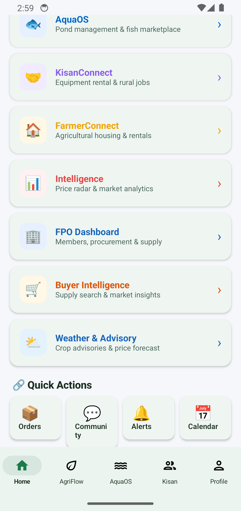  

### 📱 Platform Modules
    

### 👤 Profile & Notifications
 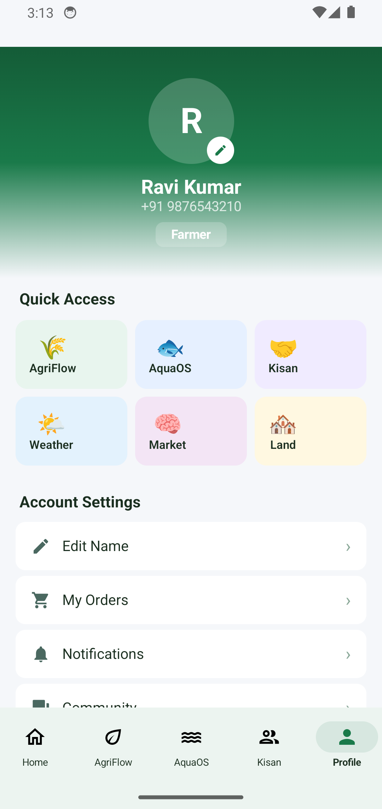 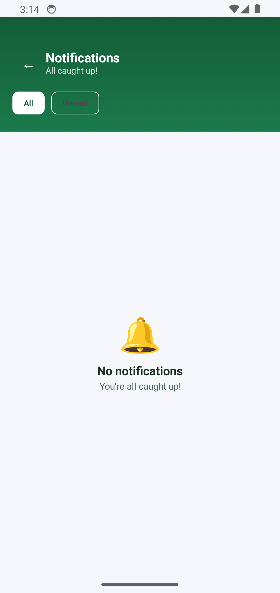 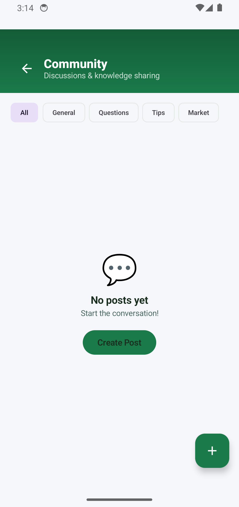 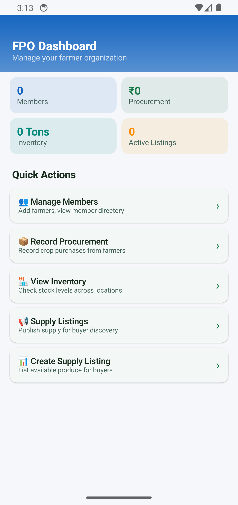

</div>

---

## 🗺️ Roadmap

<table>
<tr>
<th>Phase</th>
<th>Status</th>
<th>Features</th>
</tr>
<tr>
<td><strong>Phase 1</strong><br><sub>Foundation</sub></td>
<td>✅ Complete</td>
<td>

- [x] Auth system (OTP + JWT)
- [x] 5 core platforms (AgriFlow, AquaOS, KisanConnect, FarmerConnect, Intelligence)
- [x] PostgreSQL schema + migrations
- [x] WebSocket real-time engine
- [x] Android native app (Kotlin + Compose)
- [x] Web frontend (Vite SPA)
- [x] Docker deployment
- [x] CI/CD pipeline

</td>
</tr>
<tr>
<td><strong>Phase 2</strong><br><sub>Expansion</sub></td>
<td>✅ Complete</td>
<td>

- [x] Trade engine (B2B orders, escrow)
- [x] Chat system (real-time messaging)
- [x] Wallet & payments
- [x] Community platform
- [x] Weather integration
- [x] Training & education
- [x] Government scheme discovery
- [x] CropDoctor (disease detection)
- [x] FarmDiary (activity logging)
- [x] FPO management platform

</td>
</tr>
<tr>
<td><strong>Phase 3</strong><br><sub>Intelligence</sub></td>
<td>🔄 In Progress</td>
<td>

- [x] Price analytics & trends
- [x] District heatmaps
- [ ] ML-based yield prediction
- [ ] Satellite imagery (NDVI)
- [ ] Voice input (vernacular)
- [ ] Multi-language UI (Telugu, Hindi)
- [ ] GPS farm boundary mapping
- [ ] Crop health from drone imagery

</td>
</tr>
<tr>
<td><strong>Phase 4</strong><br><sub>Scale</sub></td>
<td>📋 Planned</td>
<td>

- [ ] iOS native app
- [ ] Admin dashboard (web)
- [ ] Multi-region expansion
- [ ] Blockchain traceability
- [ ] API marketplace (third-party)
- [ ] WhatsApp Business integration
- [ ] APMC mandi live integration
- [ ] Credit scoring for farmers

</td>
</tr>
</table>

---

## 🤝 Contributing

We welcome contributions! Here's how to get started:

```bash
# 1. Fork & clone
git clone https://github.com/YOUR-USERNAME/AAA.git

# 2. Create feature branch
git checkout -b feature/amazing-feature

# 3. Make changes & test
npm test && cd backend && npm test

# 4. Commit with conventional commits
git commit -m "feat(agriflow): add voice input for listings"

# 5. Push & create PR
git push origin feature/amazing-feature
```

**Commit Convention:**
- `feat:` New features
- `fix:` Bug fixes
- `docs:` Documentation
- `refactor:` Code restructuring
- `test:` Adding tests
- `chore:` Maintenance

---

## 📊 Project Statistics

| Metric | Value |
|:-------|:------|
| **Total Lines of Code** | 42,000+ |
| **JavaScript (Backend + Web)** | 32,474 lines |
| **Kotlin (Android)** | 8,424 lines |
| **SQL (Migrations)** | 1,592 lines |
| **Backend Route Files** | 35 modules |
| **Backend Route Lines** | 10,786 lines |
| **API Endpoints** | 100+ |
| **Database Tables** | 40+ |
| **Android Screens** | 25+ |
| **Web Screens** | 25+ |
| **Screenshots** | 37 |
| **Docker Services** | 3 |
| **CI/CD Jobs** | 6 |

---

## 📄 License

This project is licensed under the **ISC License** — see the [LICENSE](./LICENSE) file for details.

---

<div align="center">

### 🌾 Built with ❤️ for Indian Agriculture

**AgriHub** — *Empowering 140 million farmers with technology*

<br>

[⬆ Back to Top](#-agrihub)

</div>
